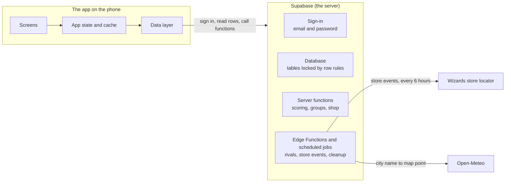
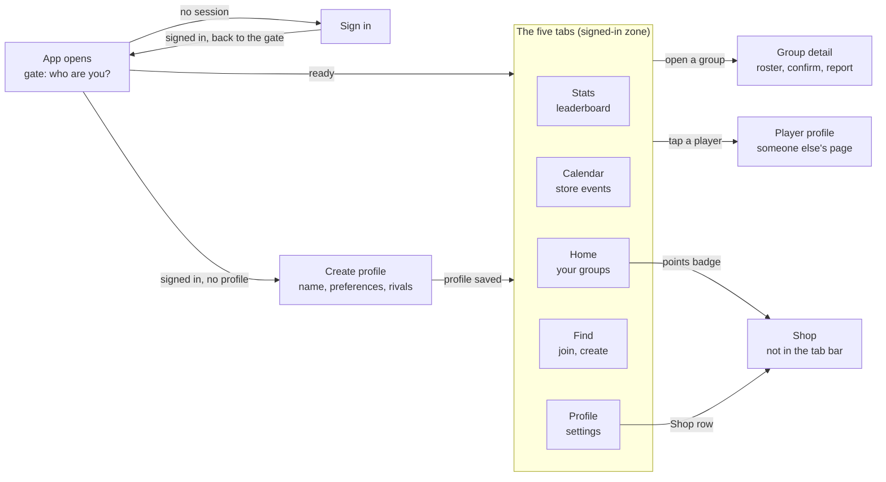
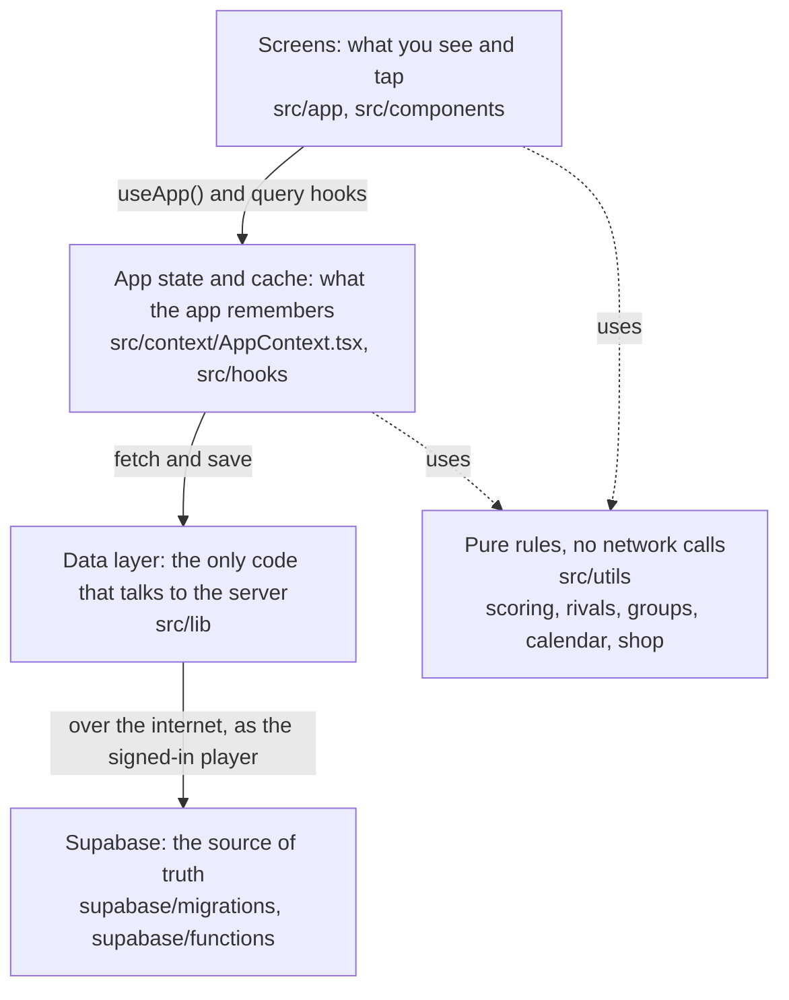
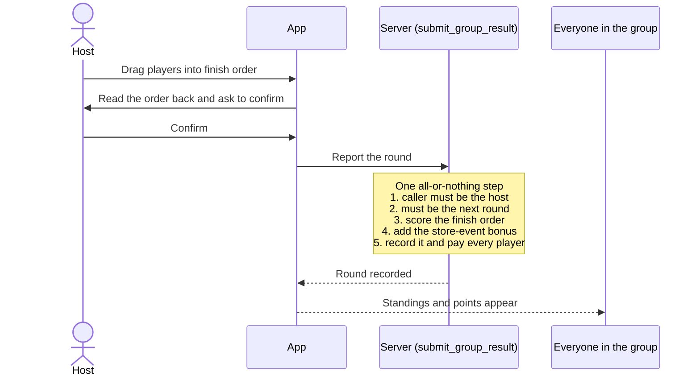
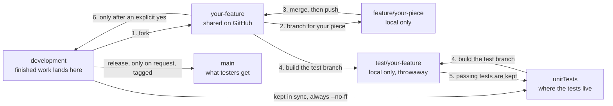

# PlayLink

*A Silvenari product.*

PlayLink is a phone app for finding and running tabletop card game nights. Players sign in,
join or post a group, report who won, earn points, and get matched with rivals. It currently
focuses on Magic: The Gathering Commander.

Built with **Expo SDK 57**, **React Native**, and **TypeScript**, on a **Supabase** backend.

**On this page:** [What it does](#what-it-does) · [How it fits together](#how-it-fits-together) ·
[Getting started](#getting-started) · [Commands](#commands) · [Project structure](#project-structure) ·
[How work moves through Git](#how-work-moves-through-git) · [More documentation](#more-documentation)

---

## What it does

- **Find a game.** Browse groups near you, join one by code, or post your own.
- **See store events.** A monthly calendar of game-store events for your area, filled in
  automatically. Start a group from a listed event to earn a bonus for playing there.
- **Report rounds.** The host drags players into finish order; everyone is paid points at once.
- **Climb and compete.** A monthly leaderboard, and up to three rivals matched to your score.
- **Spend points.** A shop of titles, name colors, and card borders.

---

## How it fits together

### The whole system

There are two halves: the app on a player's phone, and a hosted server (Supabase) that holds
every account, group, and score. The app only ever talks to Supabase. Outside services are
reached from the server, never from the phone.



### Screens

Every launch starts at one gate that checks who you are and sends you to the right place.
Once you have a profile you live in the five tabs.



### Code layers

Each layer only talks to the one below it. A screen never calls the server directly, and
`src/lib/` is the only folder allowed to.



If something looks wrong on screen, walk down the stack: is the screen showing it wrong, is
the cached copy stale, or did the server send something unexpected?

### What lives on the server

The app is treated as untrusted. Anything that matters (scores, points, purchases, who hosts
a group) can only be changed by a server function that checks who is asking.

| Table | Holds | Who can change it |
|---|---|---|
| `profiles` | One row per player: name, preferences, rivals, point totals, worn cosmetics | The player edits their own details. Points and win/loss records: server only |
| `groups` | A posted game night: where, when, host, optional link to a store event | The host edits. Deleting and changing host go through server functions |
| `group_players` | Who has a seat in which group | You can add yourself. Leaving goes through a server function |
| `group_results` | Each reported round: finish order and points paid | Server only |
| `event_areas` | Map areas players have asked for | Server only |
| `local_events` | Game-store events shown on the Calendar tab | Server only |
| `shop_items` | The catalog and its prices | Edited in Supabase Studio, no app release needed |
| `shop_purchases` | Who owns what | Server only |

Jobs that run on a timer:

| How often | Job | What it does |
|---|---|---|
| Daily | `refresh-rivals` | Re-matches rivals; resets every Score to 0 when the month rolls over |
| Every 6 hours | `sync-local-events` | Pulls store events for recently requested areas |
| Hourly | stale group cleanup | Deletes groups more than 12 hours past their start time |

### Reporting a round

This is the most important path in the app, because it is where points are created.



A report is final. There is no dispute or edit afterwards, so the read-back is the only
guard against a mis-dragged row. A retry or a double tap is refused by the server.

Each player has three numbers, all paid together when a round is reported:

| Name | What it is |
|---|---|
| **Points** | Spendable in the Shop. Only goes down when you buy something |
| **Score** | This month's earnings. Ranks the leaderboard and rival matching; resets monthly |
| **All-Time** | Everything ever earned. Never goes down |

---

## Getting started

### Prerequisites

- Node.js 20.19 or newer (the current LTS is the safe choice) and npm
- [Expo Go](https://expo.dev/go) on your phone, or an Android/iOS simulator, or a browser
- The Supabase project URL and publishable key (ask the project owner)

### Install and run

1. Install dependencies:
   ```bash
   npm install
   ```
2. Create your `.env` from the template and fill in both values. The app stops at startup
   with an error if either is missing.
   ```bash
   cp .env.example .env
   ```
   ```
   EXPO_PUBLIC_SUPABASE_URL=...
   EXPO_PUBLIC_SUPABASE_ANON_KEY=...
   ```
3. Start the dev server:
   ```bash
   npx expo start
   ```
   Press `a` for Android, `i` for iOS, or `w` for web, or scan the QR code with Expo Go.

### Showing it to someone who is not on your Wi-Fi

The normal dev server only reaches phones and computers on the same network. To let anyone
with the link in, start it with a tunnel:

```bash
npm run demo
```

Wait for "Tunnel ready". The terminal then shows a QR code and an address ending in
`exp.direct`.

- **On a phone:** install [Expo Go](https://expo.dev/go) and scan the QR code.
- **In a web browser:** open `https://<that address>` (the same address with `https://` in
  front instead of `exp://`). No install needed.

Things to know:

- It only works while that terminal is running and the computer is awake. Close it and the
  link stops.
- Everyone is using the real database, so accounts and groups made during a demo are real.
- The first load is slow, because the app is built on demand for each visitor.
- This is the development server, opened to the internet for as long as it runs. Share the
  link with people you know, and stop the server when you are done.
- The layout is designed for phones; on a laptop screen it is stretched for now.

### Machine-specific setup

Some tooling paths differ between machines and must not be committed. They live in a
gitignored file that each developer creates locally:

```bash
cp CLAUDE.local.md.example CLAUDE.local.md
```

Fill in whatever applies to your machine (most often the path to `git` if it is not on your
PATH). Never commit `CLAUDE.local.md`.

---

## Commands

| Command | What it does |
|---|---|
| `npm install` | Install dependencies |
| `npx expo start` | Start the dev server (add `--android`, `--ios`, or `--web` to pick a target) |
| `npm run demo` | Start the dev server with a tunnel, so people outside your network can open it |
| `npx tsc --noEmit` | Type-check. Only errors under `src/` count; `example/` is noise |
| `npm run lint` | Run ESLint. The baseline is not clean, so compare against it |
| `npm test` | Run all Jest tests. Only useful on `unitTests` or a `test/<feature>` branch |
| `npx jest --testPathPattern=group-utils` | Run a single test file by path fragment |

---

## Project structure

```
src/
  app/                   Screens. Every file here becomes a route
    index.tsx            The opening gate
    sign-in.tsx          Email and password sign-in
    profile-creation.tsx Onboarding
    (tabs)/              stats, calendar, home, browse (Find), profile, shop
    group-detail.tsx     Roster, confirming, reporting rounds
    player-profile.tsx   Another player's page
  components/            Shared pieces: MonthCalendar, PlayerName
  context/               AppContext: the app's shared state
  hooks/                 React Query wrappers around the data layer
  lib/                   The only code that talks to Supabase
  utils/                 Pure rules: scoring, rivals, groups, calendar, shop
  data/                  Shared types and constants
supabase/
  migrations/            Dated SQL files that build the database, in order
  functions/             refresh-rivals, sync-local-events, resolve-area
docs/                    Workflow rules, security backlog, roadmap
CLAUDE.md                The detailed written architecture guide
```

Test files are not in this tree on purpose. They exist only on the `unitTests` and
`test/<feature>` branches. Never put a test file inside `src/app/`: the router would bundle
it into the app.

---

## How work moves through Git

One rule sits above the rest: **`main` only changes when a release is explicitly asked for.**
Everything else exists to protect it.



| Branch | Lives on | Purpose |
|---|---|---|
| `main` | GitHub | Release only. Tagged at every release (e.g. `v0.1.0-mvp`). Never commit here |
| `development` | GitHub | Everything finished and tested lands here first |
| `unitTests` | GitHub | Holds every test file; kept in sync with `development` |
| `LandingPage` | GitHub | The marketing site. GitHub Pages deploys from it, so never delete it |
| `<feature>` (no prefix) | GitHub, while in progress | One feature, forked from `development`. Removed from GitHub once merged |
| `feature/<function>` | Your machine only | One piece of a feature. Merges back into its feature branch |
| `test/<feature>` | Your machine only | `unitTests` + the feature, rebuilt for each test cycle |

The steps for one feature:

```bash
git checkout development && git pull            # start from the latest
git checkout -b my-feature                      # 1. the feature branch
git push -u origin my-feature
git checkout -b feature/my-piece                # 2. your piece (never pushed)
# ...work, commit...
git checkout my-feature && git merge feature/my-piece && git push   # 3.

git checkout unitTests && git pull && git merge development --no-ff # 4.
git checkout -b test/my-feature && git merge my-feature
npm test                                        # 5. write tests, all must pass
```

Passing tests does not merge a feature. Step 6, merging into `development`, always waits
for an explicit yes. The full rules, including what to do when tests fail, are in
[`docs/version-control-workflow.md`](docs/version-control-workflow.md).

---

## More documentation

- [`CLAUDE.md`](CLAUDE.md): the detailed architecture guide and the mandatory workflow rules.
  Claude Code reads it automatically every session.
- [`docs/version-control-workflow.md`](docs/version-control-workflow.md): the full branching,
  testing, and release reference, and the list of branches in progress.
- [`docs/security-backlog.md`](docs/security-backlog.md): known gaps and what the server enforces.
- [`docs/documentation-prompt.txt`](docs/documentation-prompt.txt): the comment format every
  function must follow.
- [Expo docs for SDK 57](https://docs.expo.dev/versions/v57.0.0/) ·
  [React Native docs](https://reactnative.dev/docs/getting-started)
